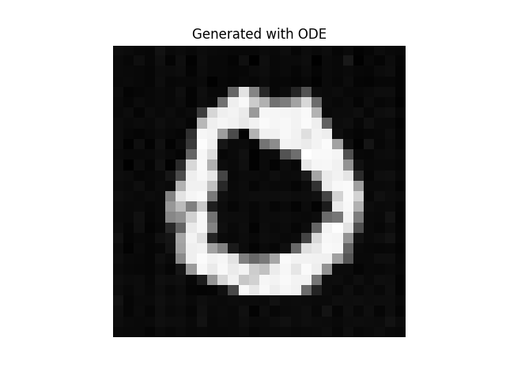
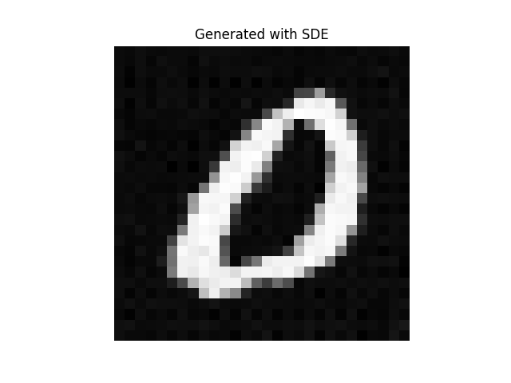
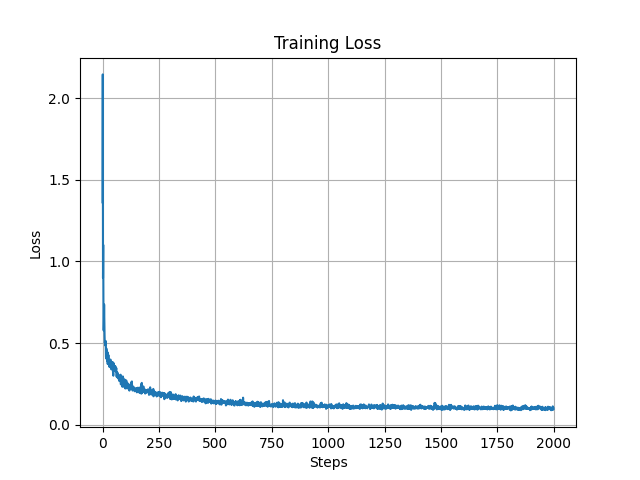

# Diffusion Model from Scratch

A diffusion and flow-based generative model implemented from scratch in PyTorch using a Transformer-based architecture (DiT-style).

The model learns a continuous-time vector field and supports both deterministic (ODE) and stochastic (SDE) sampling for image generation.

---

## Features

- Transformer-based DiT architecture for vector field modeling  
- Patch-based image tokenization  
- Time conditioning via sinusoidal embeddings  
- Adaptive normalization (time-dependent modulation)  
- Multi-head self-attention  
- Continuous-time vector field formulation (unifying flow and diffusion models)  
- Generation using:
  - ODE (deterministic sampling)
  - SDE (stochastic sampling with diffusion)

---

## Model Overview

The model learns a vector field $u_\theta(x, t)$ over data and noise interpolation.

### Training Objective

$$
\mathcal{L} = \mathbb{E}_{t, x, \epsilon} \left\| u_\theta(x_t, t) - (x - \epsilon) \right\|^2
$$

### Interpolation

$$
x_t = t x + (1 - t)\epsilon
$$

### Sampling

- **ODE (deterministic):**
  
  $$
  \frac{dx}{dt} = u_\theta(x, t)
  $$

- **SDE (stochastic):**
  
  Adds time-dependent noise during generation using a diffusion term.

---

## Repository Structure

```
.
├── model.py        # DiT-style transformer vector field model
├── train.py        # Training loop and loss computation
├── sample.py       # Image generation (ODE and SDE)
├── data.py         # MNIST loading and batching
├── config.py       # Hyperparameters and device setup
├── README.md
```

---

## Dataset

Uses the **MNIST dataset** (28×28 grayscale handwritten digits), automatically downloaded via `torchvision`.

---

## Setup

### Clone the Repository

```
git clone https://github.com/rifath95/diffusion-model-from-scratch.git
cd diffusion-model-from-scratch
```

### Install Dependencies

```
pip install torch torchvision matplotlib
```

---

## Train the Model

```
python train.py
```

- Trains the vector field model  
- Saves weights as `model.pth`  
- Plots training loss  

**Note:**  
By default, training is performed on digit **0** only (for simplicity).

To train on all digits, set in `config.py`:

```python
train_digit = None
```

---

## Generate Samples

```
python sample.py
```

- Loads trained weights (`model.pth`)  
- Generates images using:
  - ODE sampling (deterministic)
  - SDE sampling (stochastic)  

---

## Key Concepts Implemented

### Vector Field Modeling
Learns a continuous-time vector field $u_\theta(x, t)$ governing data evolution.

### DiT-style Architecture
Applies a Transformer over image patches with time conditioning.

### Adaptive Normalization
Modulates hidden representations using time-dependent scale and shift.

### Time Embedding
Uses sinusoidal embeddings to encode continuous time.

### ODE Sampling
Deterministic generation by integrating the learned vector field.

### SDE Sampling
Stochastic generation with explicit drift and diffusion terms.

---

## Sample Outputs

Generated images using the trained model:

<p align="center">
  
  
</p>

<p align="center">
  <em>Left: Generation via ODE (deterministic) &nbsp;&nbsp;&nbsp; Right: Generation via SDE (stochastic)</em>
</p>

---

## Training Dynamics

Training loss curve:

<p align="center">
  
</p>

---

## Notes

- Built to understand modern diffusion and flow-based generative models from first principles  
- Focused on mathematical clarity and full control over implementation  
- No high-level diffusion libraries are used  

---

## Future Improvements

- Train on larger datasets  
- Add higher-resolution generation  
- Implement DDPM/DDIM variants
